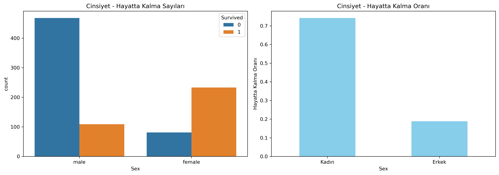
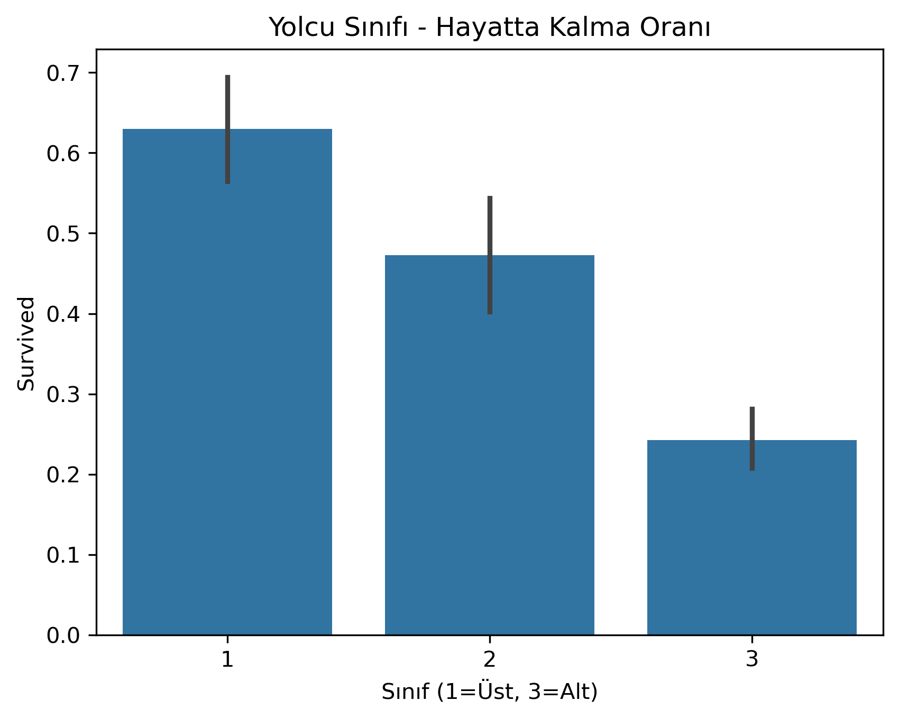
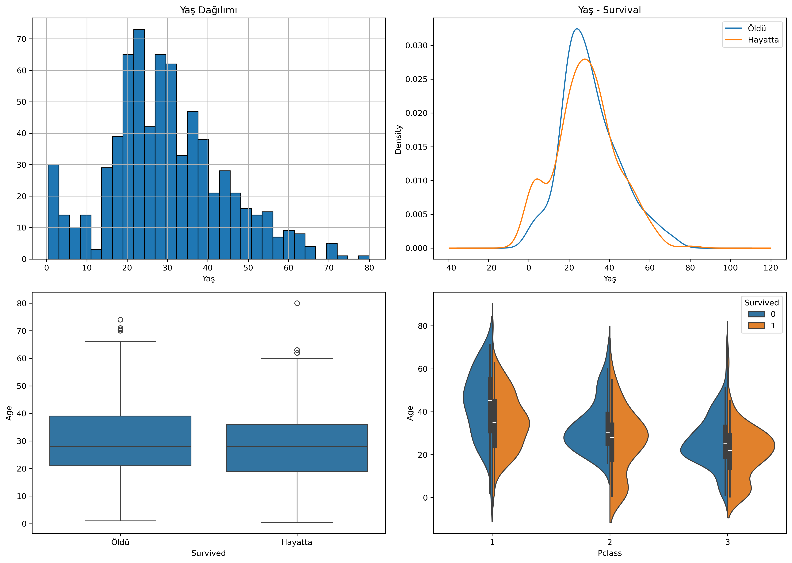
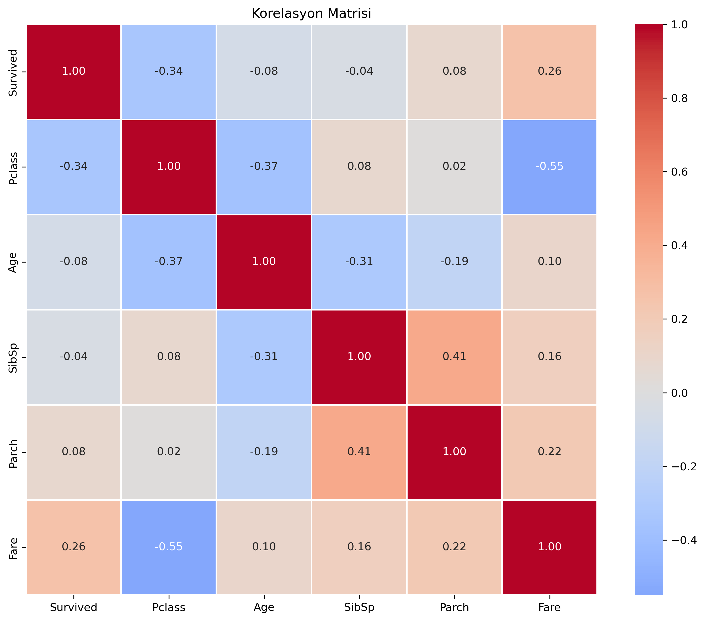
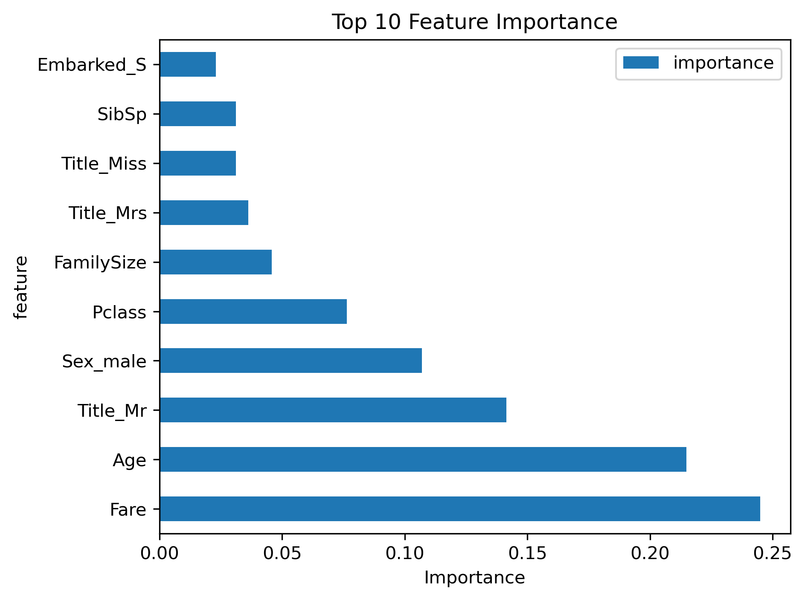
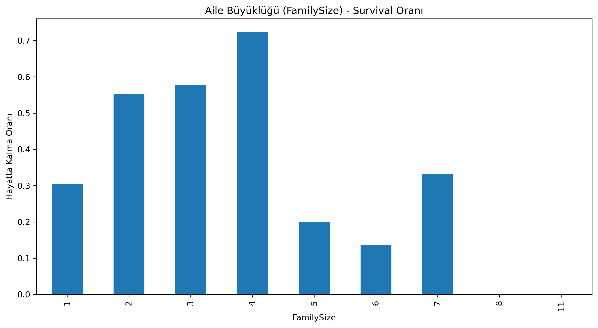

# 🚢 Titanic Survival Prediction

> 🇬🇧 [English](#-english) | 🇹🇷 [Türkçe](#-türkçe)

---

<details open>
<summary><h2>🇬🇧 English</h2></summary>

A complete data science project analyzing the Titanic dataset to predict passenger survival using exploratory data analysis (EDA), feature engineering, and machine learning.

> **Kaggle Competition:** [Titanic — Machine Learning from Disaster](https://www.kaggle.com/competitions/titanic)

### 📁 Project Structure

```
titanic-project/
├── data/
│   ├── raw/                  # Original Kaggle datasets
│   └── processed/            # Cleaned datasets after feature engineering
├── notebooks/
│   ├── 01_eda.ipynb                 # Exploratory Data Analysis
│   ├── 02_feature_engineering.ipynb # Feature creation & data cleaning
│   ├── 03_modeling.ipynb            # Model training & evaluation
│   └── 04_predictions.ipynb         # Test set predictions & submission
├── docs/
│   ├── hypotheses.md         # Pre-analysis hypotheses & validation results
│   └── eda_findings.md       # Summary of EDA findings
├── figures/                  # All generated visualizations
├── submissions/              # Kaggle submission files
├── .gitignore
└── README.md
```

### 🔍 Key Findings

| Factor | Survival Impact |
|--------|----------------|
| **Gender** | Women: **~74%** vs Men: **~19%** — strongest predictor |
| **Class** | 1st: **63%**, 2nd: **47%**, 3rd: **24%** |
| **Age** | Children (0-12): **~58%**, Elderly (60+): **~23%** |
| **Family Size** | 2-4 members: up to **~72%**, Solo: **~30%** |
| **Fare** | Higher fare → significantly higher survival |
| **Title** | Mrs: **~79%**, Miss: **~70%**, Mr: **~16%** |

#### Survival Highlights
- **1st class women** had a **96.8%** survival rate.
- **3rd class men** had the lowest at **13.5%**.
- The "women and children first" rule was clearly reflected in the data.

### 📊 Sample Visualizations

<p align="center">
  
  
</p>
<p align="center">
  
  
</p>
<p align="center">
  
  
</p>

### ⚙️ Methodology

**1. Exploratory Data Analysis** (`01_eda.ipynb`)
- Dataset inspection, missing data analysis, univariate & bivariate analysis.
- 21 visualizations generated covering survival rates across all key features.
- Hypotheses tested and documented in [`docs/hypotheses.md`](docs/hypotheses.md).

**2. Feature Engineering** (`02_feature_engineering.ipynb`)
- **FamilySize** = SibSp + Parch + 1
- **IsAlone** = 1 if FamilySize == 1
- **Title** extracted from Name (Mr, Mrs, Miss, Master, Rare)
- **Age** imputed using Pclass × Sex median
- **Embarked** imputed with mode; **Fare** imputed with median

**3. Modeling** (`03_modeling.ipynb`)
- **Random Forest Classifier** — primary model
- **Logistic Regression** — baseline comparison
- 5-fold cross-validation for robust evaluation
- Feature importance analysis

**4. Predictions** (`04_predictions.ipynb`)
- Final model applied to test set
- Submission file generated for Kaggle

### 🛠️ Tech Stack

- **Python 3.11**
- **pandas** & **NumPy** — data manipulation
- **Matplotlib** & **Seaborn** — visualization
- **scikit-learn** — machine learning

### 🚀 Getting Started

**1. Clone the repository**
```bash
git clone https://github.com/luckylaplace/titanic-survival-prediction.git
cd titanic-survival-prediction
```

**2. Download the data**

Download from [Kaggle](https://www.kaggle.com/competitions/titanic/data) and place CSV files in `data/raw/`.

**3. Install dependencies**
```bash
pip install pandas numpy matplotlib seaborn scikit-learn jupyter
```

**4. Run the notebooks**
```bash
jupyter notebook
```
Open in order: `01_eda` → `02_feature_engineering` → `03_modeling` → `04_predictions`

### 📄 Documentation

- [**Hypotheses & Findings**](docs/hypotheses.md) — Pre-analysis predictions validated against data
- [**EDA Findings**](docs/eda_findings.md) — Comprehensive analysis summary with visualizations

</details>

---

<details>
<summary><h2>🇹🇷 Türkçe</h2></summary>

Titanic veri setini kullanarak yolcuların hayatta kalma durumunu tahmin eden kapsamlı bir veri bilimi projesi. Keşifsel veri analizi (EDA), özellik mühendisliği ve makine öğrenmesi içerir.

> **Kaggle Yarışması:** [Titanic — Machine Learning from Disaster](https://www.kaggle.com/competitions/titanic)

### 📁 Proje Yapısı

```
titanic-project/
├── data/
│   ├── raw/                  # Orijinal Kaggle veri setleri
│   └── processed/            # Özellik mühendisliği sonrası temizlenmiş veriler
├── notebooks/
│   ├── 01_eda.ipynb                 # Keşifsel Veri Analizi
│   ├── 02_feature_engineering.ipynb # Özellik oluşturma ve veri temizleme
│   ├── 03_modeling.ipynb            # Model eğitimi ve değerlendirme
│   └── 04_predictions.ipynb         # Test seti tahminleri ve submission
├── docs/
│   ├── hypotheses.md         # Analiz öncesi hipotezler ve doğrulama sonuçları
│   └── eda_findings.md       # EDA bulguları özeti
├── figures/                  # Tüm görselleştirmeler
├── submissions/              # Kaggle submission dosyaları
├── .gitignore
└── README.md
```

### 🔍 Temel Bulgular

| Faktör | Hayatta Kalma Etkisi |
|--------|---------------------|
| **Cinsiyet** | Kadın: **~%74** vs Erkek: **~%19** — en güçlü tahmin edici |
| **Sınıf** | 1. sınıf: **%63**, 2. sınıf: **%47**, 3. sınıf: **%24** |
| **Yaş** | Çocuklar (0-12): **~%58**, Yaşlılar (60+): **~%23** |
| **Aile Büyüklüğü** | 2-4 kişi: **~%72**'ye kadar, Yalnız: **~%30** |
| **Bilet Ücreti** | Yüksek ücret → belirgin şekilde yüksek hayatta kalma |
| **Unvan** | Mrs: **~%79**, Miss: **~%70**, Mr: **~%16** |

#### Öne Çıkan Bulgular
- **1. sınıf kadınların** hayatta kalma oranı **%96.8**.
- **3. sınıf erkeklerin** hayatta kalma oranı en düşük: **%13.5**.
- "Kadınlar ve çocuklar önce" kuralı verilerde açıkça görülmektedir.

### 📊 Örnek Görselleştirmeler

<p align="center">
  
  
</p>
<p align="center">
  
  
</p>
<p align="center">
  
  
</p>

### ⚙️ Metodoloji

**1. Keşifsel Veri Analizi** (`01_eda.ipynb`)
- Veri seti incelemesi, eksik veri analizi, tek ve çok değişkenli analizler.
- Tüm temel özelliklerde hayatta kalma oranlarını kapsayan 21 görselleştirme.
- Hipotezler test edildi ve [`docs/hypotheses.md`](docs/hypotheses.md) dosyasında belgelendi.

**2. Özellik Mühendisliği** (`02_feature_engineering.ipynb`)
- **FamilySize** = SibSp + Parch + 1 (aile büyüklüğü)
- **IsAlone** = Yalnız mı? (FamilySize == 1)
- **Title** = İsimden unvan çıkarma (Mr, Mrs, Miss, Master, Rare)
- **Age** = Pclass × Sex medyanı ile eksikler dolduruldu
- **Embarked** = Mod ile; **Fare** = Medyan ile dolduruldu

**3. Modelleme** (`03_modeling.ipynb`)
- **Random Forest Classifier** — ana model
- **Logistic Regression** — temel karşılaştırma
- 5 katlı çapraz doğrulama
- Özellik önem analizi

**4. Tahminler** (`04_predictions.ipynb`)
- Final model test setine uygulandı
- Kaggle için submission dosyası oluşturuldu

### 🛠️ Kullanılan Teknolojiler

- **Python 3.11**
- **pandas** & **NumPy** — veri işleme
- **Matplotlib** & **Seaborn** — görselleştirme
- **scikit-learn** — makine öğrenmesi

### 🚀 Başlangıç

**1. Repoyu klonla**
```bash
git clone https://github.com/luckylaplace/titanic-survival-prediction.git
cd titanic-survival-prediction
```

**2. Veriyi indir**

[Kaggle](https://www.kaggle.com/competitions/titanic/data) adresinden indirip `data/raw/` klasörüne yerleştir.

**3. Bağımlılıkları kur**
```bash
pip install pandas numpy matplotlib seaborn scikit-learn jupyter
```

**4. Notebook'ları çalıştır**
```bash
jupyter notebook
```
Sırasıyla aç: `01_eda` → `02_feature_engineering` → `03_modeling` → `04_predictions`

### 📄 Dokümantasyon

- [**Hipotezler ve Bulgular**](docs/hypotheses.md) — Analiz öncesi tahminler ve doğrulama sonuçları
- [**EDA Bulguları**](docs/eda_findings.md) — Görselleştirmelerle kapsamlı analiz özeti

</details>

---

## 📝 License

This project is for educational purposes. The Titanic dataset is provided by [Kaggle](https://www.kaggle.com/competitions/titanic).
