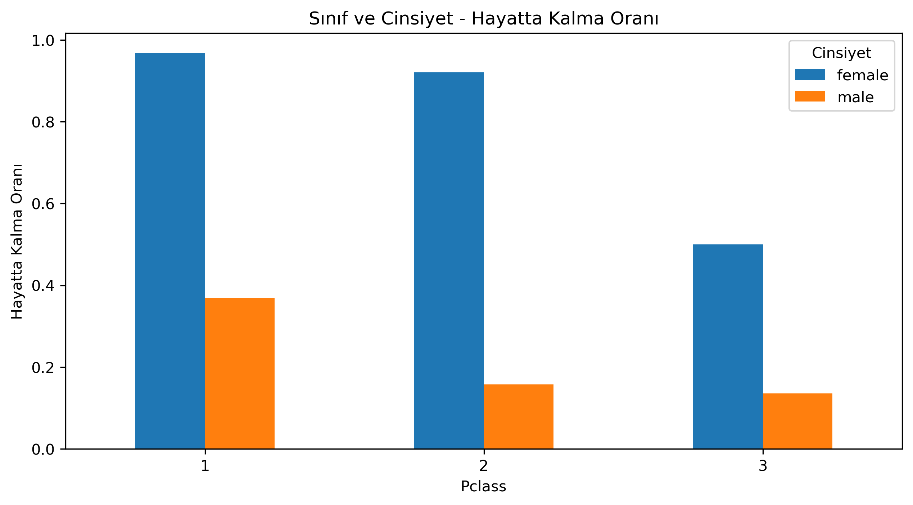
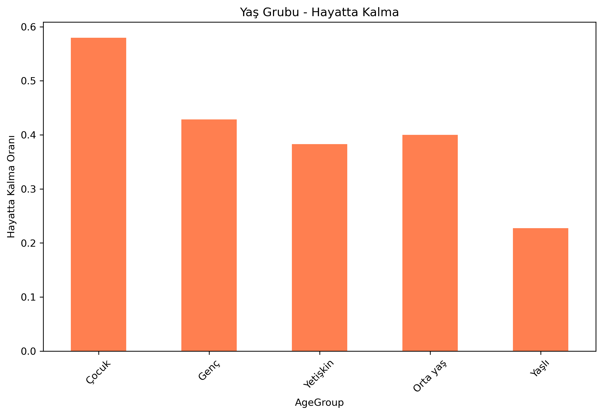
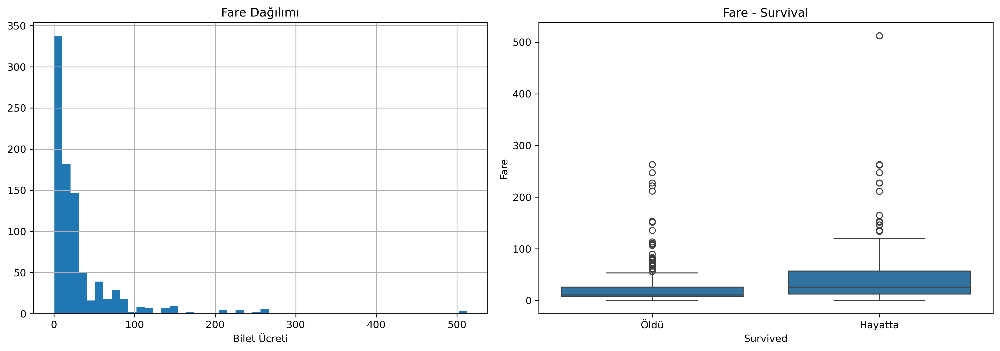
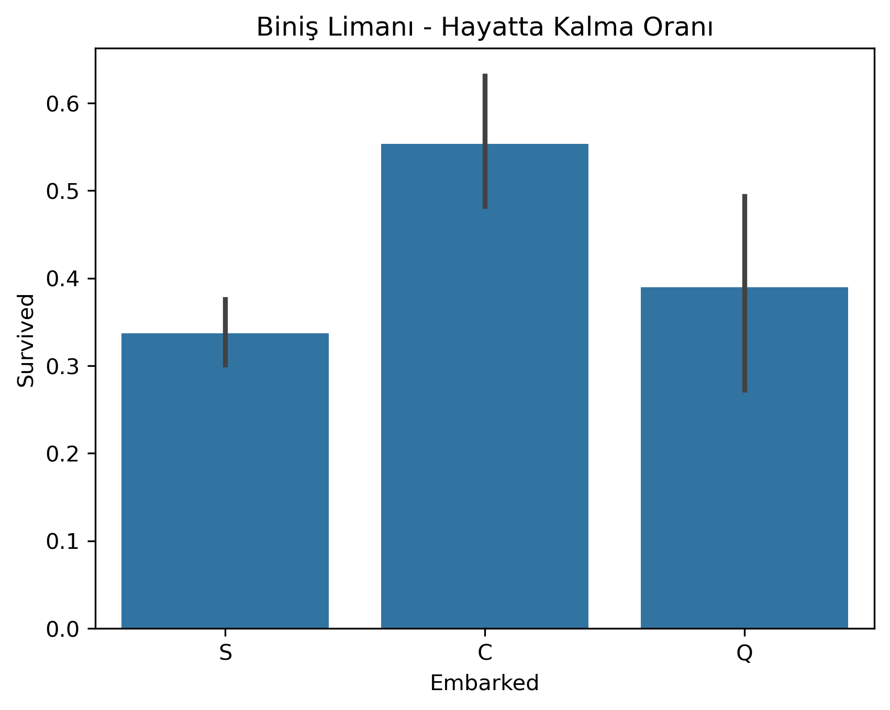
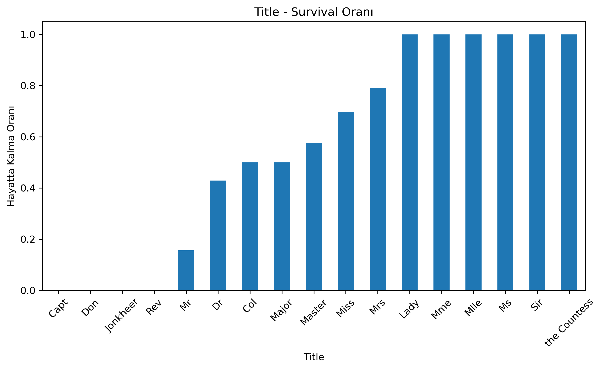

# Titanic — EDA Findings

> Summary of the key findings from the Exploratory Data Analysis performed on the Titanic training dataset (891 passengers).

---

## 1. Dataset Overview

| Property | Value |
|----------|-------|
| Total passengers (train) | 891 |
| Features | 12 (PassengerId, Survived, Pclass, Name, Sex, Age, SibSp, Parch, Ticket, Fare, Cabin, Embarked) |
| Target variable | Survived (0 = Died, 1 = Survived) |
| Overall survival rate | **38.4%** |

---

## 2. Missing Data

| Feature | Missing Count | Missing % |
|---------|--------------|-----------|
| Cabin | 687 | 77.1% |
| Age | 177 | 19.9% |
| Embarked | 2 | 0.2% |

- **Cabin** has dominant missingness — used as a binary feature (`CabinKnown`).
- **Age** was imputed using median values grouped by Pclass × Sex.
- **Embarked** was filled with the mode (Southampton).

---

## 3. Key Findings

### 3.1 Gender
- **Female survival: ~74%** vs **Male survival: ~19%**
- Gender is the single strongest predictor of survival.
- "Women and children first" rule was clearly enforced.

### 3.2 Passenger Class
- **1st class: ~63%**, **2nd class: ~47%**, **3rd class: ~24%**
- Strong class-based disparity in survival.

### 3.3 Gender × Class Interaction
- **1st class females: ~96.8%** survival — almost guaranteed.
- **3rd class males: ~13.5%** survival — lowest group.

### 3.4 Age
- Children (0-12) had the highest survival rate (~58%).
- Elderly (60+) had the lowest (~23%).
- Age distribution is roughly normal, centered around late 20s.

### 3.5 Family Size
- Optimal family size: 2-4 members (survival up to ~72%).
- Solo travelers: ~30%.
- Large families (5+): significantly lower survival.

### 3.6 Fare
- Survivors paid higher fares on average.
- Fare is right-skewed; most passengers paid < £30.
- High fare ↔ Upper class ↔ Upper deck ↔ Higher survival.

### 3.7 Embarkation Port
- **Cherbourg (C): ~55%**, Queenstown (Q): ~39%, Southampton (S): ~34%.
- Cherbourg passengers were predominantly upper class.

### 3.8 Title
- Titles extracted from names are highly predictive.
- Mrs (~79%), Miss (~70%), Master (~57%), Mr (~16%).

### 3.9 Cabin
- Passengers with known cabin info: **~67%** survival.
- Passengers without: **~30%** survival.
- Cabin letter (deck) correlates with class and proximity to lifeboats.

---

## 4. Correlation Highlights

- **Pclass ↔ Survived**: negative correlation (lower class number → higher survival).
- **Fare ↔ Survived**: positive correlation.
- **Pclass ↔ Fare**: strong negative correlation (expected).

---

## 5. Feature Importance (Random Forest)

Top features used in the final model:
1. **Sex** (encoded)
2. **Title** (extracted from Name)
3. **Fare**
4. **Age**
5. **Pclass**
6. **FamilySize**

---

## 6. Recommendations for Modeling

- **Must-use features:** Sex, Pclass, Title, Fare, Age
- **Engineered features:** FamilySize, IsAlone, CabinKnown
- **Drop:** PassengerId, Name, Ticket, Cabin (raw)
- **Handle:** Age imputation via Pclass × Sex median
